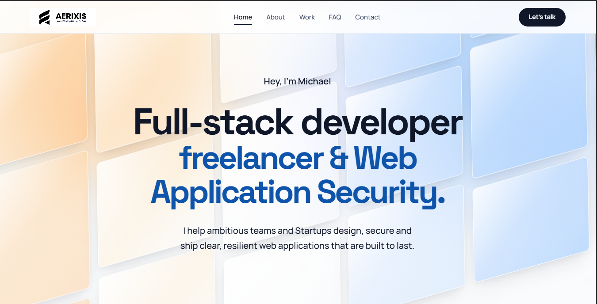

# Aerixis Portfolio

A focused portfolio landing page for **Michael Asante Anim**, a full-stack
developer and application security specialist. The site is built with plain
HTML, CSS, and JavaScript so it can be deployed directly to GitHub Pages with
no build step or framework.



## Overview

The current experience is centered around a single, high-impact hero section:

- A warm-to-cool geometric glass-panel background
- Centered introduction and professional positioning
- Responsive typography using Space Grotesk and Manrope
- Aerixis brand logo in the navigation header
- Desktop and mobile navigation
- FAQ navigation entry
- Animated tools marquee featuring Python, Django, Railway, Kali Linux,
  Burp Suite, and Metasploit
- Contact modal with client-side validation and feedback
- Staggered hero entrance animation with reduced-motion support

The visual background is intentionally static. The hero foreground uses
typography, spacing, contrast, and restrained blue accents to stay readable
over the layered panels.

## Tech Stack

- HTML5
- CSS3 with custom properties, responsive `clamp()` sizing, and keyframe
  animation
- Vanilla ES6+ JavaScript
- [Lucide Icons](https://lucide.dev)
- Google Fonts:
  - [Space Grotesk](https://fonts.google.com/specimen/Space+Grotesk)
  - [Manrope](https://fonts.google.com/specimen/Manrope)

## Project Structure

```text
├── index.html                 # Page structure, SEO metadata, navigation, hero, and contact modal
├── styles.css                 # Design tokens, responsive layout, hero background, and component styles
├── app.js                     # Navigation, mobile drawer, modal, toast, and form validation behavior
├── logo.jpeg                  # Aerixis header logo
├── Hero-Section.png           # README preview image
├── Tools/                     # Technology and security tool logos
├── favicon.ico                # Browser favicon
├── favicon-16x16.png          # Small PNG favicon
├── favicon-32x32.png          # Standard PNG favicon
├── apple-touch-icon.png       # Apple home-screen icon
├── android-chrome-192x192.png # Android/PWA icon
├── android-chrome-512x512.png # Android/PWA icon
├── site.webmanifest           # Web app metadata
└── documentation.md           # Design and implementation notes
```

## Hero Content

The hero introduces the current positioning:

> Hey, I'm Michael
>
> Full-stack developer  
> freelancer & AppSec specialist.

Supporting copy:

> I help ambitious teams design and ship clear, resilient web applications
> that are built to last.

The hero background layers are kept separate from the foreground content so
the typography and messaging can evolve without changing the visual backdrop.

## Accessibility and UX

- Semantic landmarks and heading hierarchy
- Descriptive logo alternative text
- Keyboard-visible focus states
- Mobile navigation with `aria-expanded` and `aria-hidden` state updates
- Contact dialog with labelled form controls and inline validation messages
- Visible loading and success feedback for contact submission
- Reduced-motion override for users who prefer less animation
- Touch-friendly controls with responsive layouts

## Local Development

No dependencies are required. Serve the repository from its root so relative
asset paths work correctly:

```bash
python -m http.server 8080
```

Then open [http://localhost:8080](http://localhost:8080).

You can also use any static file server, for example:

```bash
npx serve .
```

## Deployment

This is a static site and can be deployed through GitHub Pages:

1. Push the repository to GitHub.
2. Open **Settings → Pages**.
3. Select **Deploy from a branch**.
4. Choose the `main` branch and the `/ (root)` folder.
5. Save the configuration and open the generated Pages URL.

## Notes

- The contact form currently simulates submission in the browser; it does not
  send data to a backend service.
- Relative asset paths are used so the site works from a repository subpath,
  including a GitHub Pages project site.
